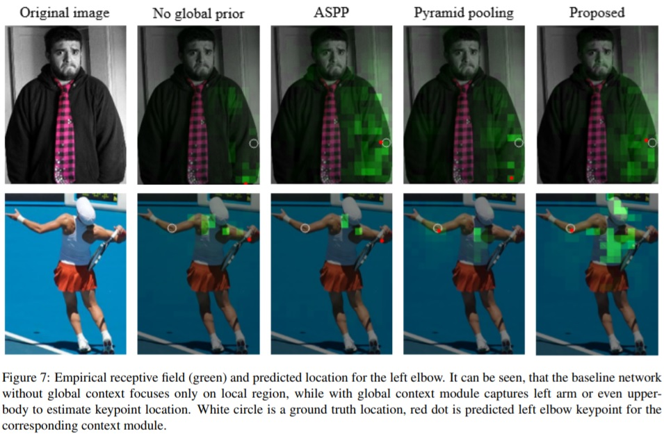

# Global Context for Convolutional Pose Machines

This repository contains training code for the paper [Global Context for Convolutional Pose Machines](https://arxiv.org/pdf/1906.04104.pdf). This work improves [original](https://arxiv.org/pdf/1602.00134.pdf) convolutional pose machine architecture for artculated human pose estimation in both accuracy and inference speed. On the Look Into Person (LIP) test set this code achives 87.9% PCKh for a single model, the 2-stage version of this network runs with more than 160 frames per second on a GPU and ~20 frames per second on a CPU. The result can be reproduced using this repository.

<p align="center">
  
</p>

## Requirements

* Ubuntu 16.04
* Python 3.6
* PyTorch 0.4.1 (should also work with 1.+, but not tested)

## Prerequisites

1. Download the [Look Into Person dataset](http://47.100.21.47:9999/overview.php) and unpack it to `<LIP_HOME>` folder.
2. Install requirements `pip install -r requirements.txt`

## Training

1. Download pre-trained MobileNet v1 weights `mobilenet_sgd_68.848.pth.tar` from: [https://github.com/marvis/pytorch-mobilenet](https://github.com/marvis/pytorch-mobilenet) (sgd option). If this doesn't work, download from [Google Drive](https://drive.google.com/file/d/18Ya27IAhILvBHqV_tDp0QjDFvsNNy-hv/view?usp=sharing).
2. Run in terminal:
```
python train.py --dataset-folder <LIP_HOME> --checkpoint-path mobilenet_sgd_68.848.pth.tar --from-mobilenet
```

## Validation
1. Run in terminal:
```
python val.py --dataset-folder <LIP_HOME> --checkpoint-path <CHECKPOINT>
```

  [OPTIONAL] Pass `--visualize` key to see predicted keypoints results.

  [OPTIONAL] Use `--multiscale` and set `flip` to `True` for better results.

The final number on the test set was obtained with addition of validation data into training.

## Pre-trained model

* Pre-trained model on the Look Into Person dataset (84.57 PCKh@0.5): [Google Drive](https://drive.google.com/file/d/1Bz9uyGTe3vphht616Loi-ZHWEhbwoD83/view?usp=sharing).

* Also there is pre-trained model on the COCO dataset. For the demo and model please check this [repository](https://github.com/opencv/openvino_training_extensions/blob/develop/pytorch_toolkit/human_pose_estimation/README_single.md#pre-trained-model).

## Conversion to OpenVINO format:

1. Convert PyTorch model to ONNX format, run script in terminal:
```
python scripts/convert_to_onnx.py --checkpoint-path <CHECKPOINT> --single-person`
```
It produces `human-pose-estimation.onnx`.

2. Convert ONNX model to OpenVINO format with Model Optimizer, run in terminal:
```
python <OpenVINO_INSTALL_DIR>/deployment_tools/model_optimizer/mo.py --input_model human-pose-estimation.onnx --input data --mean_values data[128.0,128.0,128.0] --scale_values data[256] --output stage_1_output_1_heatmaps
```
This produces model `human-pose-estimation.xml` and weights `human-pose-estimation.bin` in single-precision floating-point format (FP32).

## Citation:

If this helps your research, please cite the papers:

```
@inproceedings{osokin2019global_context_cpm,
    author={Osokin, Daniil},
    title={Global Context for Convolutional Pose Machines},
    booktitle = {arXiv preprint arXiv:1906.04104},
    year = {2019}
}

@inproceedings{osokin2018lightweight_openpose,
    author={Osokin, Daniil},
    title={Real-time 2D Multi-Person Pose Estimation on CPU: Lightweight OpenPose},
    booktitle = {arXiv preprint arXiv:1811.12004},
    year = {2018}
}
```

